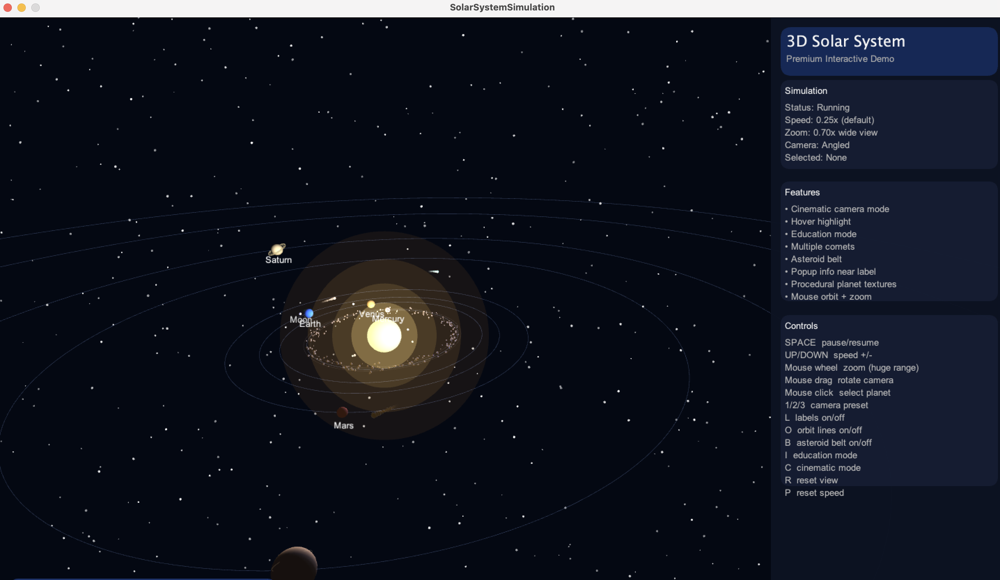
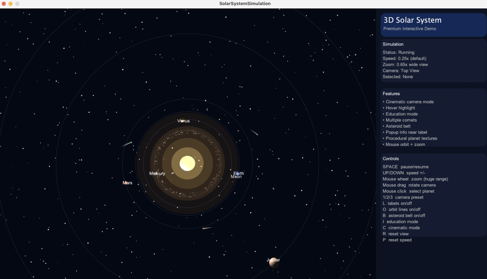
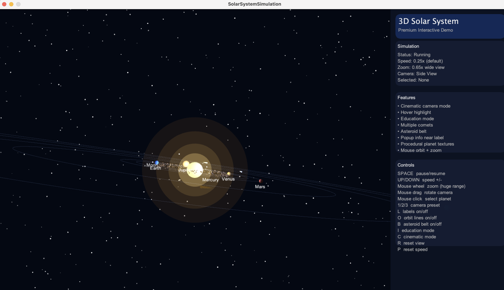

# Interactive 3D Solar System Simulation

A computer graphics final project built with Processing P3D.

## Features
- 3D solar system simulation
- Glowing Sun with point light
- Realistic relative orbit speed
- Earth Moon system
- Saturn ring
- Asteroid belt
- Multiple comets with trails
- Planet hover highlight
- Click-to-select planet info popup
- Education mode
- Cinematic camera mode
- Mouse drag camera rotation
- Mouse wheel zoom
- UI control panel

## Controls

| Key / Action | Function |
|---|---|
| SPACE | Pause / Resume |
| UP / DOWN | Increase / decrease speed |
| Mouse Wheel | Zoom in / out |
| Mouse Drag | Rotate camera |
| Mouse Click | Select planet |
| 1 / 2 / 3 | Camera views |
| L | Toggle labels |
| O | Toggle orbit lines |
| B | Toggle asteroid belt |
| I | Toggle education mode |
| C | Toggle cinematic mode |
| R | Reset view |
| P | Reset speed |

## Screenshots

## How to Run

1. Install Processing.
2. Open `SolarSystemSimulation/SolarSystemSimulation.pde`.
3. Click Run.

## Project Purpose

This project demonstrates 3D transformation, lighting, animation, camera control, user interaction, and hierarchical motion.
